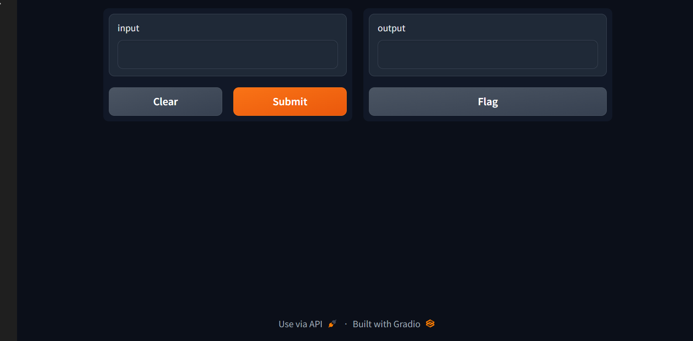

# Multilingual Speech Recognition Model Evaluation Report

## Introduction
This repository contains the evaluation report of a multilingual speech recognition model that utilizes a pre-trained multilingual speech recognition system, Multilingual Whisper. The evaluation is conducted using a diverse dataset of audio recordings in multiple languages to assess the accuracy and linguistic quality of the model's transcriptions.

## Contents
1. [Data and Testing Environment](#data-and-testing-environment)
2. [Evaluation Metrics](#evaluation-metrics)
3. [Evaluation Results](#evaluation-results)
4. [RAG Model Summarization](#rag-model-summarization)
5. [Translation and Summarization using Hugging Face](#translation-and-summarization-using-hugging-face)
6. [Conclusion](#conclusion)
7. [Project Image](#project-image)

## Data and Testing Environment
The evaluation was performed using a Python programming language in a testing environment that utilized libraries such as NLTK, spaCy, and others. The dataset comprised diverse audio recordings in multiple languages, and the ASR model was based on the pre-trained Multilingual Whisper.

## Evaluation Metrics
The evaluation metrics employed include:
- Word Error Rate (WER)
- Character Error Rate (CER)
- METEOR
- N-gram Metrics
- BLEU

## Evaluation Results
The evaluation results are summarized as follows:

| Metric      | Score       |
|-------------|-------------|
| WER         | 0.368       |
| CER         | 0.149       |
| METEOR      | 0.65        |
| N-gram (N=2) | 0.511       |
| N-gram (N=3) | 0.409       |
| N-gram (N=4) | 0.32        |
| N-gram (N=5) | 0.228       |
| BLEU        | 0.420       |

## RAG Model Summarization
The RAG model was employed to generate a summary of the report, providing a comprehensive understanding of the evaluation and its implications.

## Translation and Summarization using Hugging Face
For translation and summarization tasks, the Hugging Face library was utilized. The translation was performed using the `translation_en_to_fr` pipeline, while the summarization was executed using the `summarization` pipeline with the `facebook/bart-large-cnn` model.

## Conclusion
The evaluation demonstrates the capabilities of the multilingual speech recognition model, highlighting areas of strength and suggesting potential avenues for further improvement in multilingual ASR applications.

## Project Image

Please feel free to modify the contents as needed to provide a comprehensive overview of your project.
